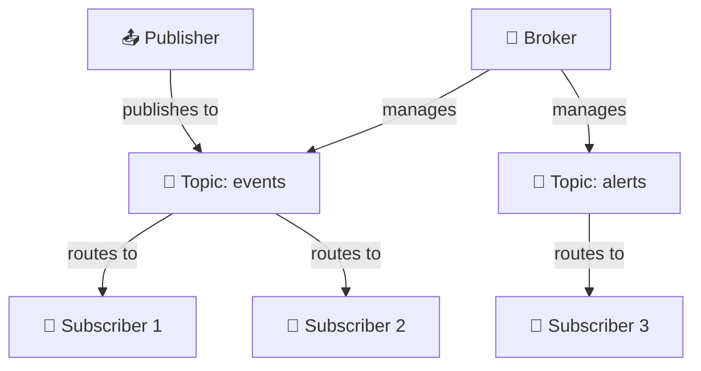
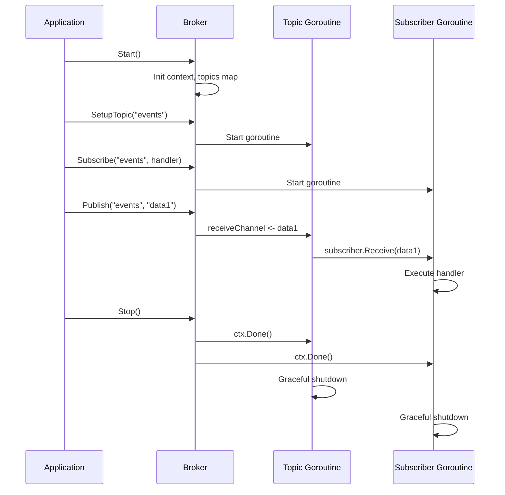

# Learning Go Concurrency with a PubSub Broker - Part 1: Architecture & Patterns

Building a pub/sub broker from scratch is one of the best ways to understand Go's concurrency model. In this first part, we'll explore how **GoBroke** uses goroutines, channels, context, and mutexes to build a thread-safe message broker. Let's dive in!

## What is a Pub/Sub Broker?

A pub/sub (publish-subscribe) broker is a messaging system where:
- **Publishers** send messages to topics without caring who receives them
- **Subscribers** listen to topics and receive messages
- The **broker** acts as the middleman, routing messages from publishers to all subscribers

It's like a radio station—broadcasters send signals, and anyone with a tuned receiver can listen in.

## The Architecture at a Glance

GoBroke has a clean layered architecture:



The broker manages topics, topics manage subscribers and publishers. Let's see how concurrency makes this work.

## Pattern 1: Protecting Shared State with Mutexes

Go's motto is **"Share memory by communicating"**, but sometimes you need to protect shared data structures. That's where `sync.Mutex` comes in.

In the broker, we have a map of topics that multiple goroutines might access simultaneously:

```go
type BrokerImpl struct {
    topics map[string]Topic
    mu     sync.Mutex  // Protects access to topics map
    
    ctx    context.Context
    cancel context.CancelFunc
}
```

Every time we access or modify the `topics` map, we lock it:

```go
func (b *BrokerImpl) GetTopic(topicName string) Topic {
    b.mu.Lock()
    defer b.mu.Unlock()
    return b.topics[topicName]
}
```

**Why?** Without the lock, two goroutines could try to read/write the map simultaneously, causing a race condition. The `defer b.mu.Unlock()` ensures the lock is released even if something panics.

### The `sync.Once` Pattern

When starting the broker, we need to initialize the topics map only once:

```go
func (b *BrokerImpl) Start() {
    var once sync.Once
    once.Do(func() {
        b.mu.Lock()
        defer b.mu.Unlock()
        
        b.topics = make(map[string]Topic)
        b.ctx, b.cancel = context.WithCancel(context.Background())
    })
}
```

`sync.Once` ensures the initialization block runs exactly once, even if multiple goroutines call `Start()` simultaneously. This is more elegant than manual flag checking!

## Pattern 2: Channels for Communication

Channels are Go's primary tool for communicating between goroutines. Topics use a channel to receive published messages:

```go
type TopicImpl struct {
    receiveChannel chan any  // Buffered channel for incoming messages
    stopChannel    chan bool // Signal to stop the topic
    // ...
}
```

The topic runs in its own goroutine, listening on these channels:

```go
go func() {
    for {
        select {
        case <-t.stopChannel:
            // Graceful shutdown signal
            return
            
        case <-ctx.Done():
            // Context cancelled (broker shutting down)
            t.Stop()
            
        case data := <-t.receiveChannel:
            // New message received - distribute to subscribers
            for _, subscriber := range t.subscribers.all {
                subscriber.Receive(data)
            }
        }
    }
}()
```

This `select` statement is the heart of the pattern. It listens on multiple channels and handles whichever is ready first. It's like a multiplexer—handling different types of events in one place.

### Buffering Messages

The `receiveChannel` is buffered:

```go
receiveChannel: make(chan any, bufferSize)  // Default: 10
```

This means publishers don't block when sending a message—they can drop the message into the channel and continue. Without buffering, publishers would block until a subscriber reads each message.

## Pattern 3: Context for Graceful Shutdown

Go's `context` package is essential for coordinating work across goroutines. When the broker shuts down, it needs to signal all topics and subscribers to stop gracefully.

```go
func (b *BrokerImpl) Start() {
    b.ctx, b.cancel = context.WithCancel(context.Background())
}

func (b *BrokerImpl) Stop() {
    b.cancel()  // Signal all goroutines using this context
}
```

When `b.cancel()` is called, all `<-ctx.Done()` operations wake up and can clean up. Each topic and subscriber checks for this:

```go
select {
case <-t.stopChannel:
    return
case <-ctx.Done():
    t.Stop()  // Graceful shutdown
case data := <-t.receiveChannel:
    // Process message
}
```

This pattern ensures that when you call `broker.Stop()`, everything shuts down in an orderly fashion instead of abruptly terminating goroutines.

## Pattern 4: Goroutines for Concurrent Work

Each topic and each subscriber runs in its own goroutine:

```go
// Topic goroutine
go func() {
    // Listen and distribute messages
}()

// Subscriber goroutine
go func() {
    // Listen for new messages to process
}()
```

This allows them to work concurrently. One slow subscriber won't block others—each processes messages independently.

### The Goroutine Lifecycle

A subscriber's goroutine looks like this:

```go
func (s *SubscriberImpl) Start(ctx context.Context) {
    s.mu.Lock()
    if s.stopChannel != nil {
        return  // Already started
    }
    s.stopChannel = make(chan bool)
    
    go func() {
        s.mu.Unlock()
        
        for {
            select {
            case <-s.stopChannel:
                return  // Stop signal
                
            case <-ctx.Done():
                s.Stop()  // Context cancelled
                
            case data := <-s.strategy.Consume():
                // Process the message
                s.strategy.GetWorkerStrategy().Execute(s.handler, data)
            }
        }
    }()
}
```

Notice the `s.mu.Unlock()` inside the goroutine. We unlock *after* spawning the goroutine to avoid the goroutine accessing `s.stopChannel` before it's set. This is a subtle but important concurrency detail!

## Pattern 5: Thread-Safe Subscriber List

Topics maintain a list of subscribers. Since subscribers can be added/removed while messages are being distributed, this list needs protection:

```go
type Subscribers struct {
    all []Subscriber
    mu  sync.Mutex
}

// In topic's message loop:
t.subscribers.mu.Lock()
subs := t.subscribers.all
// ... send message to each subscriber
t.subscribers.mu.Unlock()  // Importantly: NOT using defer here
```

Why not use `defer`? The code comment explains it: *"defer will wait until the end of the function, which is after the for loop."* We want to unlock immediately after copying the subscriber list, not after distributing messages to all of them.

## How It All Works Together

Here's the complete flow:



The sequence shows:

1. **Create broker** → Initializes context
2. **Setup topic** → Creates a goroutine that listens for messages
3. **Subscribe** → Adds subscriber to topic's list, starts subscriber's goroutine
4. **Publish** → Sends message to topic's channel
5. **Topic's goroutine** → Receives message, distributes to all subscribers
6. **Subscriber's goroutine** → Receives message, processes it
7. **Unsubscribe/Stop** → Context cancellation or explicit signals trigger graceful shutdown

## Key Takeaways

- **Mutexes** protect shared mutable state (the topics map, subscriber list)
- **Channels** communicate between goroutines efficiently
- **Context** coordinates graceful shutdown across the system
- **Goroutines** enable concurrent processing without callbacks
- **Select statements** multiplex multiple concurrent operations

These patterns work together to create a safe, scalable system. The magic of Go is that this feels natural and readable, not bureaucratic.

In **Part 2**, we'll look at how the broker uses the **Strategy Pattern** to give subscribers fine-grained control over how they handle messages—dealing with backpressure, buffering, and concurrent processing.

---

*Ready to level up? Check out Part 2 where we explore Strategy Patterns for subscriber behavior!*
