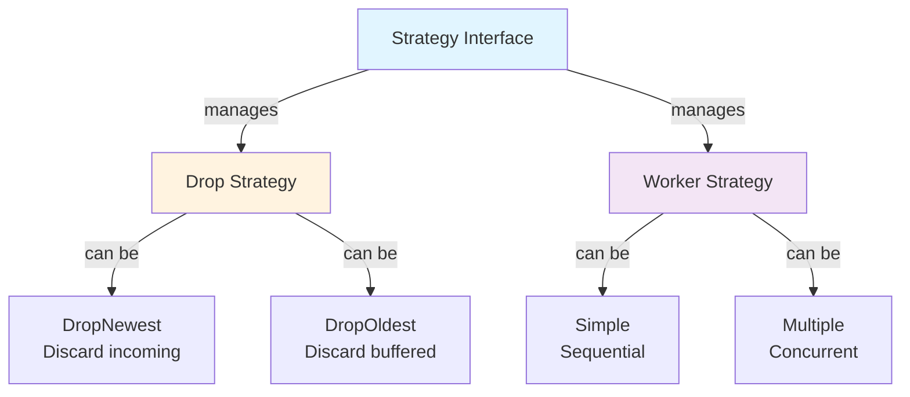
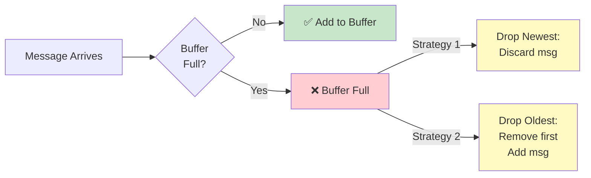
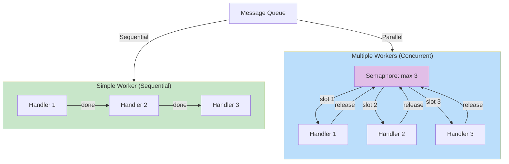
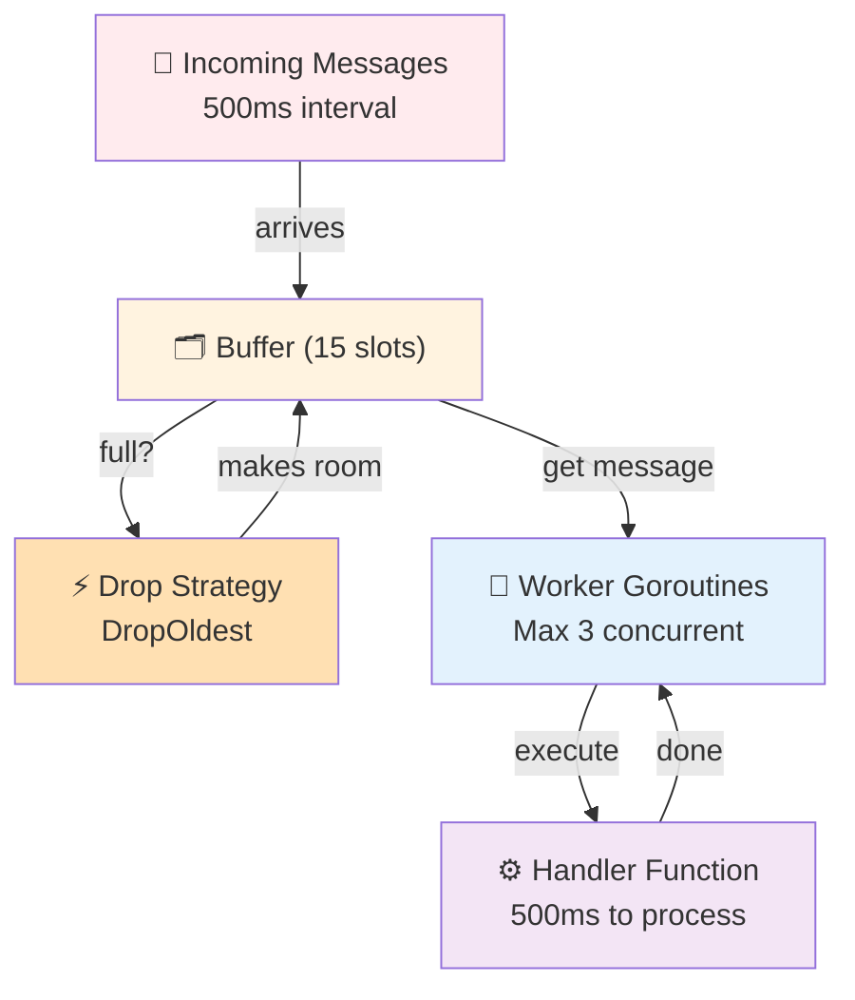
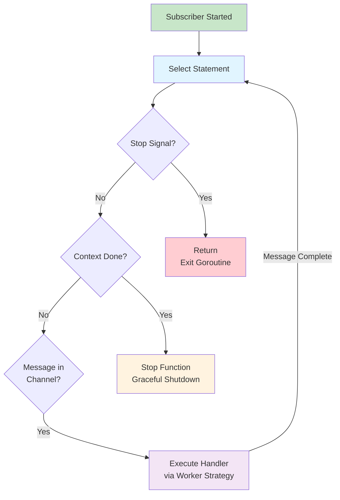
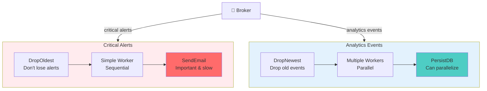

# Learning Go Concurrency with a PubSub Broker - Part 2: Strategy Pattern for Subscribers

In Part 1, we learned how GoBroke uses goroutines, channels, and context to build a concurrent message broker. Now we'll explore how **Strategy Pattern** gives subscribers the flexibility to handle messages in different ways.

The core problem: when a subscriber is slow or receives too many messages, what happens? The Strategy Pattern lets us answer this question in different ways without changing the broker itself.

## The Strategy Pattern Overview

The Strategy Pattern is one of the simplest yet most powerful design patterns. Instead of hardcoding behavior, you encapsulate different behaviors into interchangeable strategy objects.

In GoBroke, subscribers use strategies to answer two key questions:

1. **Drop Strategy**: *"What should we do if the buffer is full?"*
   - Drop the newest message (make room)
   - Drop the oldest message (keep it fresh)

2. **Worker Strategy**: *"How should we execute the handler?"*
   - One at a time (simple)
   - Multiple concurrently (with a limit)



## The Strategy Interface

Let's look at the core interface:

```go
type Strategy interface {
    Receive(data any)
    Consume() chan any
    Stop()
    
    GetFullStrategy() DropStrategy
    GetWorkerStrategy() WorkerStrategy
    
    WithDrop(strategyType SubscriberFullStrategyType) Strategy
    WithSimpleWorker() Strategy
    WithMutipleWorker(maxWorker int) Strategy
}
```

This follows a **Builder Pattern** too—you chain methods to configure the strategy. Let's see how!

## Creating a Strategy

Here's how simple it is:

```go
// Default: 10-message buffer, drop newest if full, process one at a time
strategy := gobroke.NewStrategy(gobroke.SingleBuffered)

// Customize it:
strategy := gobroke.NewStrategy(gobroke.SingleBuffered, 20).
    WithDrop(gobroke.DropOldest).
    WithMutipleWorker(3)
```

The strategy is created with a buffered channel that subscribers will use to queue messages:

```go
func NewStrategy(strategyType SubscriberStrategyType, bufferSize ...int) Strategy {
    resolvedBufferSize := 10
    if len(bufferSize) > 0 {
        resolvedBufferSize = bufferSize[0]
    }
    channel := make(chan any, resolvedBufferSize)
    
    return SingleBufferedConsumerStrategy{
        channel: channel,
    }.WithDrop(DropNewest).WithSimpleWorker()
}
```

## Strategy 1: Handling Backpressure with Drop Strategies

When a subscriber can't keep up with incoming messages, the buffer fills up. What then?



### Drop Newest Strategy

The **default** strategy: discard incoming messages when the buffer is full.

```go
type DropNewestStrategy struct{}

func (s *DropNewestStrategy) Drop(strategy Strategy, data any) {
    // Simply do nothing - the message is lost
    // The sender continues without blocking
}
```

**Use case**: You have a fast message rate but don't need every single message. For example, sensor readings where the latest value is more important than historical ones.

```go
strategy := gobroke.NewStrategy(gobroke.SingleBuffered, 5).
    WithDrop(gobroke.DropNewest)
```

When the 6th message arrives, it's silently discarded. The subscriber processes messages from the buffer, but never gets behind.

### Drop Oldest Strategy

The **alternative**: when the buffer is full, remove the oldest message to make room for the new one.

```go
type DropOldestStrategy struct{}

func (s *DropOldestStrategy) Drop(strategy Strategy, data any) {
    discarded := <-strategy.Consume()  // Remove oldest
    log.Printf("discarded %v", discarded)
    strategy.Consume() <- data          // Add newest
}
```

**Use case**: You don't want to lose any messages—you'd rather sacrifice old ones. For example, log events where you want to keep the most recent activity.

```go
strategy := gobroke.NewStrategy(gobroke.SingleBuffered, 5).
    WithDrop(gobroke.DropOldest)
```

Now the 6th message bumps out the 1st one, ensuring all messages are processed eventually, just not in the original order.

### How It's Used

The subscriber receives a message and tries to send it to the channel:

```go
func (s SingleBufferedConsumerStrategy) Receive(data any) {
    select {
    case s.channel <- data:
        // Successfully sent!
        return
    default:
        // Buffer is full - execute drop strategy
        s.full.Drop(s, data)
    }
}
```

The `select` with `default` is the key—if the channel is full (non-blocking send fails), we invoke the drop strategy.

## Strategy 2: Processing with Worker Strategies

Once a message is received and buffered, how should it be processed? That's where **Worker Strategies** come in.



### Simple Worker Strategy

Process one message at a time:

```go
type SimpleWorkerStrategy struct{}

func (s SimpleWorkerStrategy) Execute(handler func(data any), data any) {
    handler(data)  // Just call it
}
```

**Use case**: Most handlers are fast or you need messages processed in strict order.

Example:
```go
handler := func(data any) {
    log.Printf("Processing: %v", data)  // Fast operation
}

strategy := gobroke.NewStrategy(gobroke.SingleBuffered).
    WithSimpleWorker()
```

Each message is processed sequentially. If a message takes 1 second, the next one waits.

### Multiple Worker Strategy

Process multiple messages concurrently with a limit:

```go
type MultipleWorkerStrategy struct {
    maxRoutine int
    guard      chan any  // Semaphore to limit concurrent goroutines
}

func (s MultipleWorkerStrategy) Execute(handler func(data any), data any) {
    s.guard <- data  // Acquire slot
    
    go func() {
        handler(data)  // Do work
        <-s.guard      // Release slot
    }()
}
```

**Use case**: Handlers are slow (like database operations or API calls) and you want to parallelize.

Example:
```go
handler := func(data any) {
    time.Sleep(time.Second)  // Slow operation (DB query, HTTP request)
    log.Printf("Processed: %v", data)
}

strategy := gobroke.NewStrategy(gobroke.SingleBuffered, 20).
    WithMutipleWorker(5)  // Max 5 concurrent handlers
```

Now up to 5 messages are processed in parallel, each in its own goroutine. The `guard` channel acts like a **semaphore**—it's a buffered channel with capacity equal to the max concurrent workers. When you acquire a slot (`guard <- data`), you can only go up to `maxRoutine` handlers running at once.

### The Semaphore Pattern

The semaphore pattern is elegant. Think of it like parking spots:

```go
guard := make(chan any, maxRoutine)  // Create N parking spots

// To start work:
guard <- data  // Try to park

go func() {
    handler(data)  // Do the work
    <-guard        // Leave the spot
}()
```

When all spots are full, `guard <- data` blocks until a worker finishes and releases a spot. This is how we limit concurrency without explicit counters or mutex-based locks.

## Combining Strategies

The real power emerges when you combine drop and worker strategies:



What happens here?

1. Messages arrive at 500ms intervals (faster than handlers process them)
2. The 15-message buffer fills up
3. New messages trigger drop strategy—oldest gets discarded
4. Meanwhile, up to 3 handlers run concurrently
5. The system stays responsive and never blocks publishers

## Why Is This a Good Pattern?

**Flexibility**: Change subscriber behavior without touching the broker. A slow subscriber can use multiple workers; a bursty one can drop old messages.

**Composition**: Strategies work independently. Drop strategies don't know about worker strategies. You can add more strategies later without breaking existing code.

**Testability**: Each strategy is a small, focused object. Easy to test in isolation.

**Separation of Concerns**: The broker doesn't care *how* subscribers buffer or process messages—strategies handle that.

## The Subscriber Lifecycle

Here's how strategies tie into the subscriber's message loop:



## Real-World Example

Imagine you're building a notification system:



Same broker, same publisher, but completely different handling strategies tailored to each subscriber's needs.

## Key Takeaways

- **Strategy Pattern** lets subscribers choose their own behavior
- **Drop strategies** handle backpressure gracefully
- **Worker strategies** control concurrency and throughput
- **Semaphores** (buffered channels) limit concurrent work elegantly
- **Builder Pattern** makes configuration readable and chainable
- Strategies are **independent and composable**

The Strategy Pattern transforms a rigid pub/sub system into a flexible, adaptable one. Each subscriber can optimize for its own constraints without affecting others.

---

*You've now learned two fundamental patterns in Go concurrency! The broker demonstrates principles you'll use in countless Go projects. Next time: more advanced patterns or maybe persistence?*
