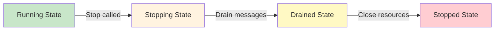
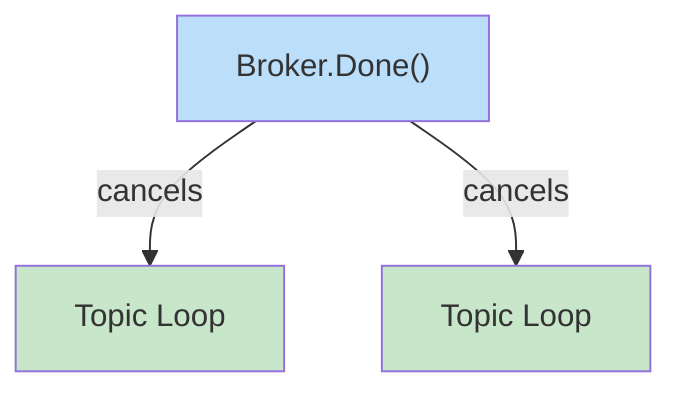
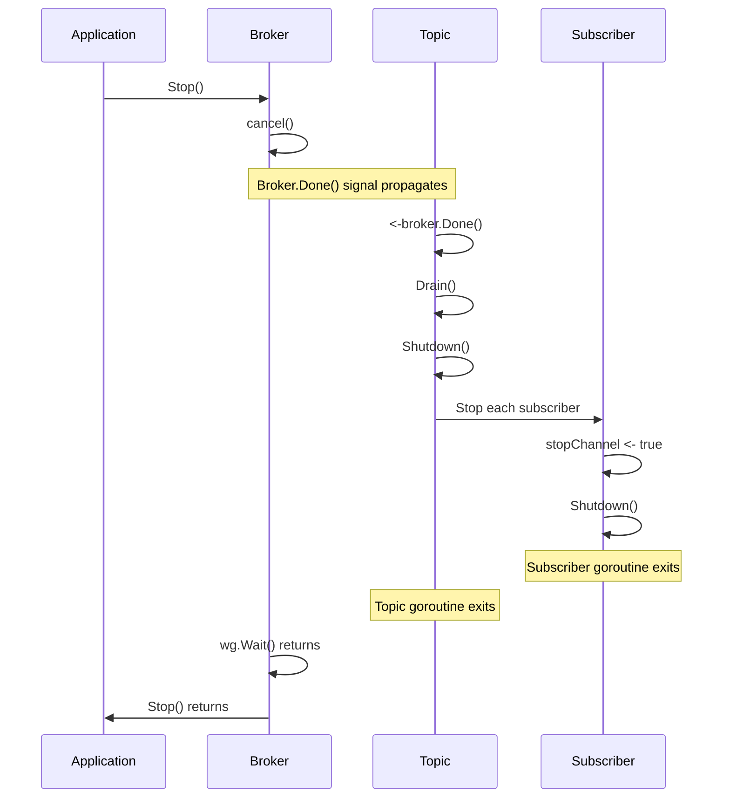
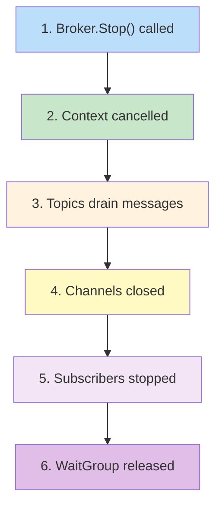

# Learning Go Concurrency with a PubSub Broker - Part 3: Graceful Shutdown

In Parts 1 and 2, we built a powerful concurrent message broker. Now comes a critical question: how do we shut it down safely? A naive shutdown might lose messages or leave goroutines hanging. In this part, we'll explore how GoBroke implements **graceful shutdown**—a pattern that's essential for production systems.

## Why Graceful Shutdown Matters

Imagine you're running a service that processes messages. You need to update the code. What happens if you just kill the process?

- Messages in flight might be lost
- Publishers might crash trying to send to a closed channel
- Goroutines might leak, never completing their work

Graceful shutdown solves this by:
1. Stopping new work from arriving
2. Draining in-flight messages
3. Closing resources cleanly
4. Preventing goroutine leaks



## The Shutdown Architecture

GoBroke uses a **context-based cascade** and **WaitGroup tracking**. The broker coordinates the shutdown:

```go
type BrokerImpl struct {
    ctx    context.Context
    cancel context.CancelFunc
    wg     *sync.WaitGroup
}
```

When stopping:

```go
func (b *BrokerImpl) Stop() {
    b.cancel()  // Signal all goroutines via context
    b.wg.Wait() // Wait for all topics to finish
}
```

Topics check for broker cancellation:

```go
select {
case <-t.stopChannel:
    t.Shutdown()
    return
case <-t.broker.Done():  // Broker's context
    t.Shutdown()
    return
case data := <-t.receiveChannel:
    t.SendToAllSubscribers(data)
}
```



## The Shutdown Sequence

Let's trace what happens when you call `broker.Stop()`:



### Step 1: Context Cancellation

When `b.cancel()` is called, every goroutine waiting on `broker.Done()` wakes up immediately.

### Step 2: Topics Drain and Stop

Each topic's loop receives the broker cancellation:

```go
case <-t.broker.Done():
    t.Shutdown()
    return
```

The topic then drains remaining messages before closing:

```go
func (t *TopicImpl) Drain() {
    for {
        select {
        case data := <-t.receiveChannel:
            for _, subscriber := range t.subscribers.all {
                subscriber.Receive(data)
            }
        default:
            return
        }
    }
}
```

Then shutdown stops all subscribers and closes the channel:

```go
func (t *TopicImpl) Shutdown() {
    t.Drain()
    
    close(t.receiveChannel)
    
    for _, sub := range t.subscribers.all {
        sub.Stop()
    }
    
    t.broker.ReleaseTopic(t)
}
```

### Step 3: Subscribers Stop

When a subscriber receives the stop signal:

```go
func (s *SubscriberImpl) Stop() {
    s.stopChannel <- true
}
```

The subscriber's loop exits:

```go
select {
case <-s.stopChannel:
    s.Shutdown()
    return
case data := <-s.strategy.Consume():
    s.strategy.GetWorkerStrategy().Execute(s.handler, data)
}
```

And cleans up:

```go
func (s *SubscriberImpl) Shutdown() {
    s.strategy.Stop()
}
```

### Step 4: WaitGroup Synchronization

The broker tracks all topics with a WaitGroup:

```go
func (b *BrokerImpl) SetupTopic(params TopicSetupParams) Topic {
    b.wg.Add(1)
    return topic
}

func (b *BrokerImpl) ReleaseTopic(topic Topic) {
    b.wg.Done()
}
```

When all topics call `ReleaseTopic()`, the WaitGroup is done, and `broker.Stop()` returns.

## Critical: Avoiding Goroutine Leaks

A goroutine leak happens when goroutines never terminate. In GoBroke, protection comes from multiple sources:

```mermaid
graph TB
    Stop1["Stop Signal"]
    Done["Broker.Done Signal"]
    Message["Message in Channel"]
    
    Sub["Subscriber Goroutine"]
    
    Stop1 -->|explicit| Sub
    Done -->|implicit| Sub
    Message -->|processes| Sub
    
    Sub -->|receives any| "Exit Safely"
    
    style Stop1 fill:#ffcdd2
    style Done fill:#fff3e0
    style Message fill:#f3e5f5
```

The subscriber loop has multiple exit points:

```go
select {
case <-s.stopChannel:
    s.Shutdown()
    return
case data := <-s.strategy.Consume():
    s.strategy.GetWorkerStrategy().Execute(s.handler, data)
}
```

If the broker shuts down while a subscriber is processing:
1. The handler finishes its current work
2. The next loop iteration checks `stopChannel` and exits
3. Even if the channel closes, the receive still returns and the loop can break

## Pattern: Shutdown with Timeout

In practice, you often want to wait for graceful shutdown with a timeout:

```go
ctx, cancel := context.WithTimeout(context.Background(), 30*time.Second)
defer cancel()

broker.Stop()  // Triggers graceful shutdown
<-ctx.Done()   // Wait or timeout
```

The key is that `broker.Stop()` **waits** for completion via `wg.Wait()`, so it blocks until all topics have drained and stopped.

## Order Matters: The Shutdown Cascade

The shutdown order in GoBroke is critical:



**Why this order?**

1. **Context cancellation** is non-blocking and propagates everywhere safely
2. **Drain** processes remaining buffered messages so subscribers finish their work
3. **Close channels** once no goroutine is sending
4. **Stop subscribers** explicitly via `sub.Stop()`
5. **Release WaitGroup** to signal broker shutdown is complete

## Real-World Scenario: A Shutdown Bug

Here's a common mistake:

```go
// BAD: Closes channel before stopping goroutines
close(b.receiveChannel)  // Goroutines still running!
b.cancel()
```

This causes a panic if a goroutine tries to send after the channel closes.

The correct approach in GoBroke:

```go
// GOOD: Cancel context first, then drain
b.cancel()
b.wg.Wait()  // Wait for all topics to finish

// Topics then handle:
// 1. Drain remaining messages
// 2. Stop subscribers
// 3. Close channels safely
// 4. Report done via ReleaseTopic()
```

The **key principle**: Let goroutines close their own channels, not the other way around.

## Testing Graceful Shutdown

Test to verify shutdown works correctly:

```go
func TestGracefulShutdown(t *testing.T) {
    broker := gobroke.NewBroker()
    broker.Start()
    defer broker.Stop()
    
    broker.SetupTopic(gobroke.TopicSetupParams{Name: "test"})
    
    received := 0
    broker.Subscribe("test", gobroke.SubscribeParams{
        Handler: func(data any) {
            received++
            time.Sleep(100 * time.Millisecond)
        },
    })
    
    broker.Publish("test", "data")
    time.Sleep(50 * time.Millisecond)
    
    broker.Stop()  // Graceful shutdown waits for in-flight work
    
    if received != 1 {
        t.Error("Message not processed during shutdown")
    }
}
```

This verifies:
- No panic occurs
- In-flight work completes during shutdown
- `Stop()` waits for completion before returning

## Key Patterns in GoBroke's Shutdown

### 1. Topic Status Tracking

Topics track their state:

```go
type TopicStatus int

const (
    TopicInitialized TopicStatus = iota
    TopicRunning
    TopicDraining
    TopicStopped
)
```

This prevents operations like `Publish()` or `Subscribe()` from working on a stopped topic:

```go
func (t *TopicImpl) Publish(data any) {
    if t.status != TopicRunning {
        return
    }
    t.receiveChannel <- data
}
```

### 2. Explicit Drain Before Close

Before closing the receive channel, the topic drains all buffered messages:

```go
func (t *TopicImpl) Drain() {
    for {
        select {
        case data := <-t.receiveChannel:
            for _, subscriber := range t.subscribers.all {
                subscriber.Receive(data)
            }
        default:
            return
        }
    }
}
```

This ensures no messages are lost during shutdown.

### 3. WaitGroup Coordination

The broker tracks all topics:

```go
b.wg.Add(1)        // When topic starts
b.wg.Done()         // When topic stops
b.wg.Wait()         // In Stop() to wait for all topics
```

This ensures `Stop()` doesn't return until all topics have finished gracefully.

## Looking Ahead

Graceful shutdown is a cornerstone of reliability. It's why Go's context package is so powerful—it's designed exactly for this problem. In production systems, you'll find these patterns everywhere:

- Web servers shutting down cleanly
- Connection pools draining before closing
- Background workers finishing tasks before exit
- Distributed systems coordinating shutdown across services

The GoBroke broker demonstrates these principles in a relatively simple system. As your systems grow more complex, these patterns scale beautifully.

---

*Next steps: Want to add persistence? Metrics? Distributed topics? The foundation you've learned here applies to all of them. The graceful shutdown pattern remains your safety net.*
