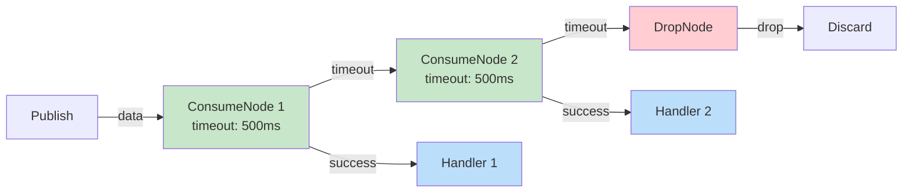

# Learning Go Concurrency with a PubSub Broker - Part 4: From Strategy Union to Chain

In Part 2, we explored how strategies gave subscribers flexible behavior through composition. GoBroke has since evolved from a **union pattern** to a **chain pattern**, enabling far greater flexibility. This part explores why this rework happened and how it empowers users to define custom message consumption patterns.

## The Problem with v1: Strategy Union

The original v1 strategy had fixed components: backpressure, DLQ, and worker. But what if you need:
- Multiple processing stages?
- Custom drop logic between stages?
- Conditional routing based on data?
- Custom handlers outside the handler function?

The union pattern couldn't easily answer these questions.

## The Chain Solution

The chain pattern treats message handling as a **pipeline of nodes**:



Each node decides: consume the message or pass it to the next node.

## Core Abstractions

The chain is built on simple interfaces:

```go
type ChainNode interface {
    Consume(strategy strategies.Strategy, data any)
    Then(node ChainNode) ChainNode
    Stop(strategy strategies.Strategy)
    Drop(data any)
}

type StrategyChain interface {
    Strategy
}
```

A node can either:
1. Consume the data (handle it)
2. Pass it to the next node via `Then()`
3. Stop gracefully
4. Drop the data

## Nodes in Action

### ConsumeNode

A consume node runs a worker pool and processes messages:

```go
type ConsumeNode struct {
    timeOut time.Duration
    name    string
    runner  *utils.BaseRunner
    drop    DropType
    Nextable
}

func (c *ConsumeNode) Consume(strategy strategies.Strategy, data any) {
    timeOut := time.After(c.timeOut)
    select {
    case c.runner.Receive() <- data:
        log.Printf("[%s] consume node consuming %v", c.name, data)
        return
    case <-timeOut:
        log.Printf("[%s] consume node busy, passing to next", c.name)
        c.Next(strategy, data)  // Pass to next node
    }
}
```

If the consume node is busy (timeout), it passes the message to the next node instead of blocking.

### DropNode

A terminal node that drops messages:

```go
type DropNode struct{}

func (d *DropNode) Consume(strategy strategies.Strategy, data any) {
    log.Printf("last node, dropping %v", data)
    strategy.Drop(data)
}
```

### ByPassNode

A pass-through node for conditional routing:

```go
type ByPassNode struct {
    Nextable
}

func (b *ByPassNode) Consume(strategy strategies.Strategy, data any) {
    b.Next(strategy, data)  // Always pass to next
}
```

## Building a Chain

Create a chain strategy using `NewStrategyFromSlice`:

```go
strategy := chain.NewStrategyFromSlice([]chain.ChainNode{
    chain.NewConsumeNode(chain.NewConsumeNodeParams{
        TimeOut: time.Millisecond * 500,
        Drop:    chain.DropFirst,
        Name:    "primary",
        Runner: worker.NewMultipleWorkerPool(
            worker.MultipleWorkerPoolParams{
                MaxWorker:  3,
                BufferSize: 1,
                Handler: func(data any) {
                    // Primary handler
                },
            }),
    }),
    chain.NewConsumeNode(chain.NewConsumeNodeParams{
        TimeOut: time.Millisecond * 500,
        Name:    "fallback",
        Runner: worker.NewMultipleWorkerPool(
            worker.MultipleWorkerPoolParams{
                MaxWorker:  1,
                BufferSize: 1,
                Handler: func(data any) {
                    // Fallback handler (e.g., DLQ)
                },
            }),
    }),
    chain.NewDropNode(),  // Terminal node
})

broker.NamedSubscribe(topic, "sub", gobroke.SubscribeParams{
    Strategy: strategy,
})
```

Message flow:
1. Try primary handler (3 concurrent workers)
2. If busy for 500ms, try fallback handler (1 worker)
3. If fallback busy for 500ms, drop

## The Processor Pattern: Custom Consumption Logic

Behind each consume node is a **Runner** with a **Processor**. This is where custom logic lives:

```go
type Processor interface {
    Process(data any)
    CleanUp(channel chan any)
}

type BaseRunner struct {
    channel     chan any
    stopChannel chan any
    processor   Processor
}
```

The runner's loop demonstrates the **stop signal pattern** we learned in Part 3:

```go
func (r *BaseRunner) Start() {
    for {
        select {
        case data := <-r.channel:
            r.processor.Process(data)
        case <-r.stopChannel:
            r.Drain()
            close(r.channel)
            close(r.stopChannel)
            r.processor.CleanUp(r.channel)
            return
        }
    }
}
```

The loop has:
1. Data processing path
2. Stop signal path with graceful drain

### Custom Processor Example

Create your own processor for custom consumption:

```go
type MyProcessor struct {
    handler func(data any)
}

func (m MyProcessor) Process(data any) {
    m.handler(data)
}

func (m MyProcessor) CleanUp(channel chan any) {
    // Drain and cleanup
    for len(channel) > 0 {
        data := <-channel
        m.handler(data)
    }
}
```

Then wrap it in a runner:

```go
runner := utils.NewBaseRunner(bufferSize, MyProcessor{
    handler: customHandler,
})
```

Use it in a consume node:

```go
chain.NewConsumeNode(chain.NewConsumeNodeParams{
    TimeOut: time.Millisecond * 500,
    Runner:  runner,
    Name:    "custom",
})
```

## Design Note: Stop Signal Pattern Reuse

The `BaseRunner` reuses the **stop signal pattern** from Part 3:

```mermaid
graph TB
    Loop["Main Loop"]
    Select["Select Statement"]
    
    Process["Process Data"]
    Stop["<-stopChannel"]
    
    Drain["Drain()")
    Close["Close channels")
    Cleanup["CleanUp()"])
    Return["Return"])
    
    Loop --> Select
    Select -->|data| Process
    Select -->|stop| Stop
    Stop --> Drain
    Drain --> Close
    Close --> Cleanup
    Cleanup --> Return
    
    style Select fill:#e1f5ff
    style Stop fill:#ffcdd2
    style Drain fill:#fff3e0
    style Close fill:#fff9c4
    style Cleanup fill:#f3e5f5
```

This pattern (select with stop signal, drain, then cleanup) is now **portable and reusable**. Any component can adopt it by embedding the runner concept.

## From Chain to Custom Nodes

You can create custom chain nodes by implementing the interface:

```go
type ChainNode interface {
    Consume(strategy strategies.Strategy, data any)
    Then(node ChainNode) ChainNode
    Stop(strategy strategies.Strategy)
    Drop(data any)
}
```

Example: A rate-limiting node

```go
type RateLimitNode struct {
    limiter chan struct{}
    Nextable
}

func (r *RateLimitNode) Consume(strategy strategies.Strategy, data any) {
    select {
    case <-r.limiter:
        r.Next(strategy, data)
    default:
        strategy.Drop(data)
    }
}

func (r *RateLimitNode) Stop(strategy strategies.Strategy) {
    close(r.limiter)
    r.Nextable.Stop(strategy)
}
```

Embed `Nextable` to get `Then()` and `Next()` for free.

## Freedom in Message Handling

The chain pattern frees you from the v1 constraints:

1. **No fixed components** - Compose any nodes you want
2. **Reorderable** - Chain nodes in any order
3. **Extensible** - Implement `ChainNode` for custom logic
4. **Conditional** - Nodes can route based on data content or state
5. **Graceful** - Each node handles its own shutdown

Instead of "what strategies do I apply?", you ask "what pipeline do I build?".

## Key Takeaways

- **Chain Pattern > Union Pattern** for flexible composition
- **Processor interface** lets you define custom consumption logic
- **BaseRunner** encapsulates the stop signal pattern for reuse
- **Nodes are composable** - each is independent and chainable
- **Graceful shutdown propagates** through all nodes in the chain

## Looking Ahead

The chain rework demonstrates an important principle: as systems grow, **flexibility through composition beats flexibility through configuration**. The v1 union had predefined slots; the chain builds pipelines on demand.

This pattern scales to:
- Multi-stage processing pipelines
- Conditional message routing
- Custom priority queues
- Dead letter queues with retry logic
- Complex monitoring and filtering

---

*Next: How to extend chains for production features like circuit breakers, metrics, and persistence.*
